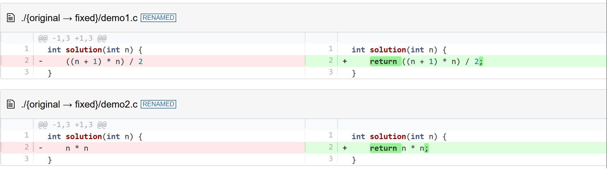

# Sankey-Errors

> ⚠️ This project will not be maintained, feel free to fork for changes.


Visualizing different error categories in code as an interactive sankey chart. Originally created as part of my master thesis in the group on [Artificial Intelligence for Programming (AIP)](https://aip.ifi.uni-heidelberg.de/home) at [Heidelberg University](https://www.uni-heidelberg.de/en).

The webpage can be used to see changes between different revisions of, for example, a code-to-code translation model. 

## Data format
The visualization does not assume any use case only a data schema. You need to provide data similar to [demo.json](./demo.json):
```json
{
    "nodes": [
        {"name": "original/Success", "value": 2, "depth": 0},
        {"name": "original/Error", "value": 2, "depth": 0},
        {"name": "fixed/Success", "value": 4, "depth": 1}
    ],
    "links": [
        {
            "source": "original/Success",
            "target": "fixed/Success",
            "value": 2,
            "changes": [
                {"diff": ""},
                {"diff": ""}
            ]
        },
        {
            "source": "original/Error",
            "target": "fixed/Success",
            "value": 2,
            "changes": [
                {"diff": "diff --git ..."},
                {"diff": "diff --git ..."}
            ]
        }
    ]
}
```

The diffs can be provided in git diff or unified diff format. I recommend generating the diffs using the following command with the paths properly adjusted:

```bash
git diff -U1000 --no-index version1/file1.c version2/file1.c
```

The demo file should result in the following simple sankey chart:


Clicking on the bottom flow should result in the following diff being displayed below the chart:



You can specify further attributes of nodes and links according to the [echarts documentation](https://echarts.apache.org/en/option.html#series-sankey.data)